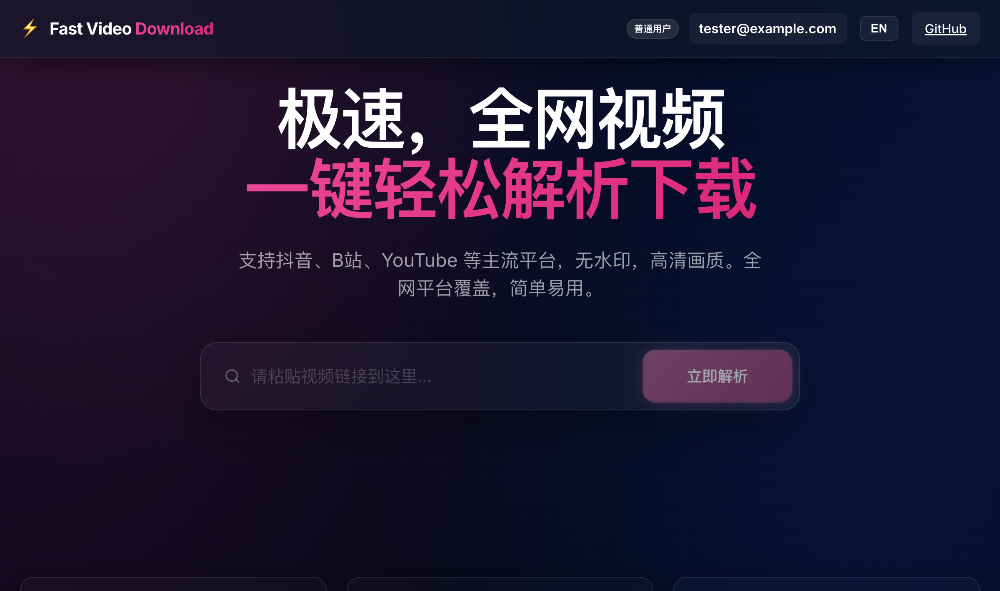
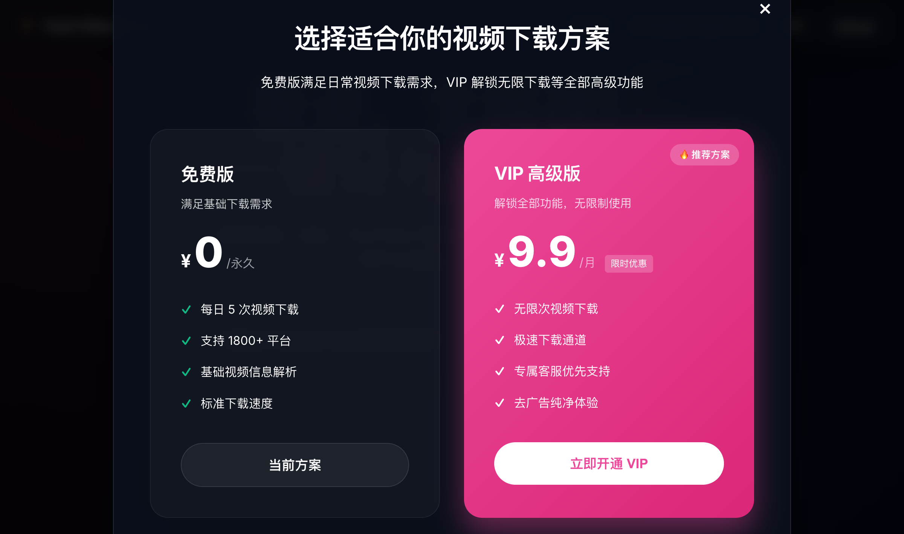
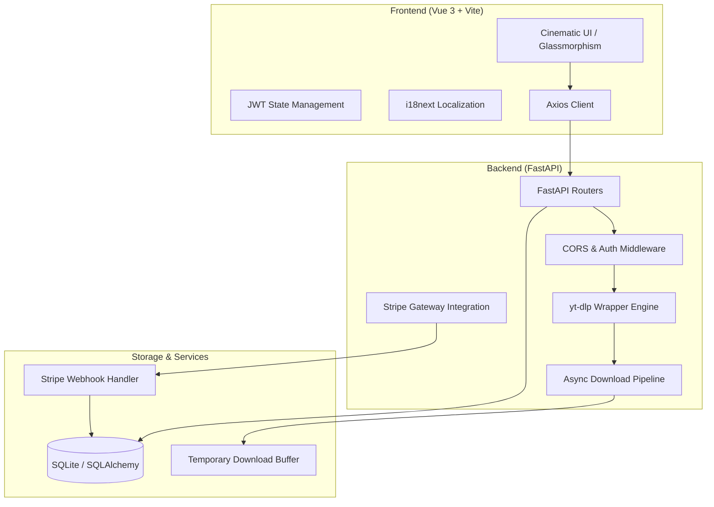

# Fast Video Download ⚡️

[](https://github.com/ZKQuinn/fast-video-download)
[](LICENSE)

**一个针对极致体验设计的生产级全能视频下载解决方案。** 
本项目不仅是一个工具，更是一套完整的现代 Web 开发实践——涵盖了异步高并发处理、响应式设计系统、JWT 认证、国际化方案、以及支付网关集成。

---

## 🖼 视觉展示 (Showcase)

<div align="center">
  
  <p><i>图 1：基于 OLED 灵感的沉浸式暗色模式预览</i></p>
  
  <br />
  
  
  <p><i>图 2：打磨极致的 VIP 会员支付方案界面</i></p>
</div>

---

## 🏗 项目架构 (System Architecture)

该系统采用解耦的 **C/S 架构**，前后端通过 RESTful API 进行高效通信。



### 核心设计细节：
1. **异步任务管道**：利用 FastAPI 的异步特性，所有视频解析与下载任务均通过非阻塞方式执行，确保高并发下的系统响应速度。
2. **流式数据转发**：后端实现了一个高效的流式数据转发层，支持在下载过程中直接透传内容给浏览器，无需服务器等待整个文件下载完成。
3. **安全隔离**：核心支付密钥与用户数据通过环境变量和数据库模型进行隔离，符合最小权限原则。

---

## 🚀 核心特性 (Key Features)

- **⚡️ 极致性能**：集成 `yt-dlp` 与 `static-ffmpeg`，支持全网 1800+ 平台的 4K/1080P 超清解析与音视频自动合并。
- **🎨 电影感 UI/UX**：深度打磨的 OLED 暗色模式，采用 Glassmorphism（毛玻璃）与动态渐变光效，提供极致视觉享受。
- **🌍 全球化支持**：内置完善的 i18n 国际化引擎，支持中英文实时一键切换。
- **💎 商业化集成**：完整的 VIP 会员体系，集成 **Stripe** 支付流程与 Webhook 自动回调，支持每日额度限制策略。
- **🛡 健壮解析**：针对国内主流平台（如抖音、B站）实现高仿真 Referer 注入与反爬突破策略。

---

## 🛠 技术深度 (Technical Depth - 面试重点)

如果您是正在查看此项目的面试官，以下是该项目的一些核心技术亮点：

*   **全异步后端架构**：采用 `FastAPI` + `SQLAlchemy(Async)`，在处理耗时 IO 操作（视频下载）时能保持极高的并发处理能力。
*   **优雅的错误处理与 i18n 协同**：前端实现了一套响应式的错误拦截系统，能自动识别后端业务错误码并映射到对应的国际化提示。
*   **Stripe 支付完整闭环**：实现了从创建 Checkout Session 到处理异步 Webhook 回调的完整商业支付逻辑。
*   **CSS 设计系统**：虽然不依赖 Tailwind，但项目建立了一套严密的 CSS 变量驱动的设计系统，支持高效率的主题调整与组件复用。

---

## 🚥 环境准备与启动

本项目推荐使用 `.env` 文件进行配置。

### 1. 后端配置 (backend/.env)
```bash
STRIPE_API_KEY=your_sk_key
STRIPE_WEBHOOK_SECRET=your_whsec_key
SECRET_KEY=your_jwt_secret
```

### 2. 后端启动
```bash
cd backend
pip install -r requirements.txt
uvicorn main:app --reload
```

### 3. 前端启动
```bash
cd frontend
npm install
npm run dev
```

---

## ⚖️ 免责声明 (Compliance & Disclaimer)

本项目仅用于 **技术学习和研究目的**。
用户在使用本程序下载任何音视频内容时，必须确保已获得原作者授权并遵守相关法律法规。任何滥用导致的后果由用户个人承担。

---
© 2024 Fast Video Download. Developed with ❤️ by ZKQuinn.
