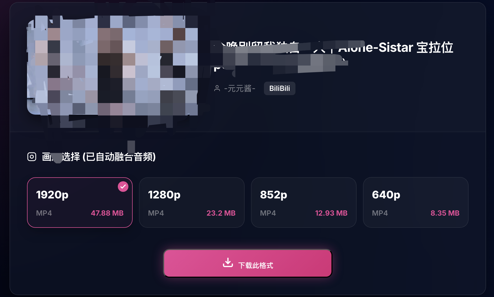
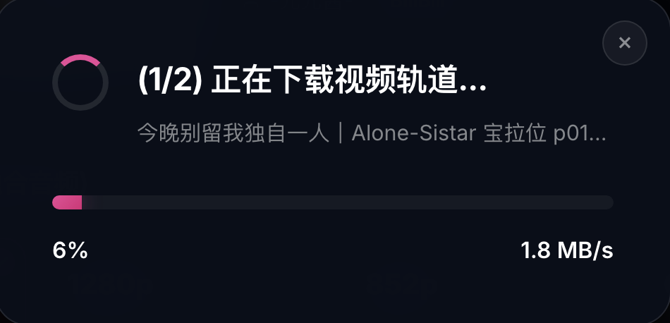
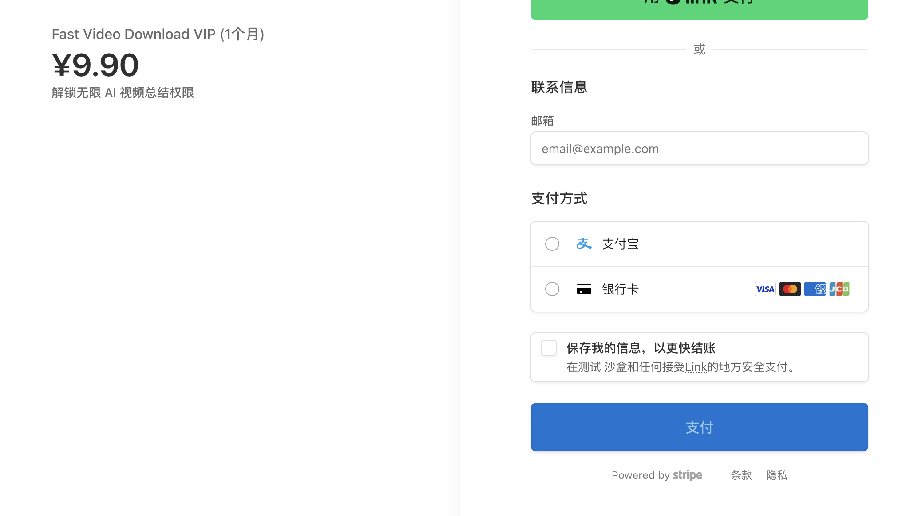
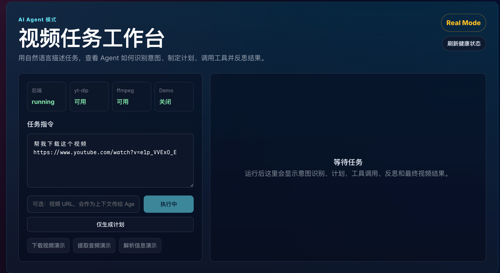
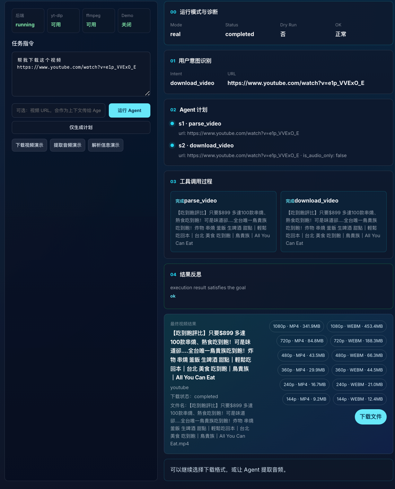
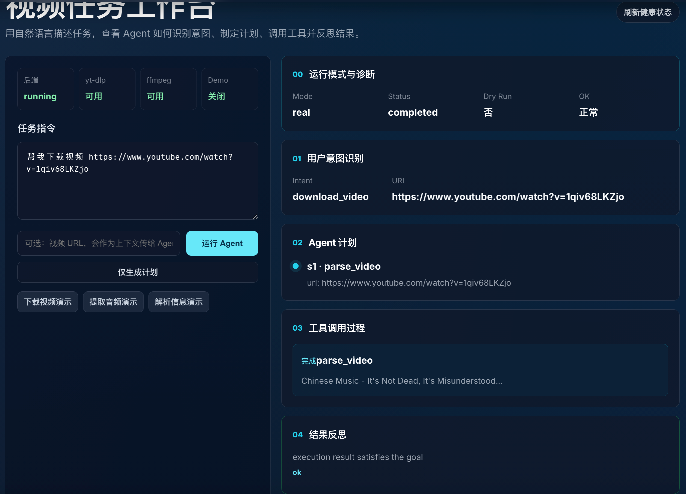
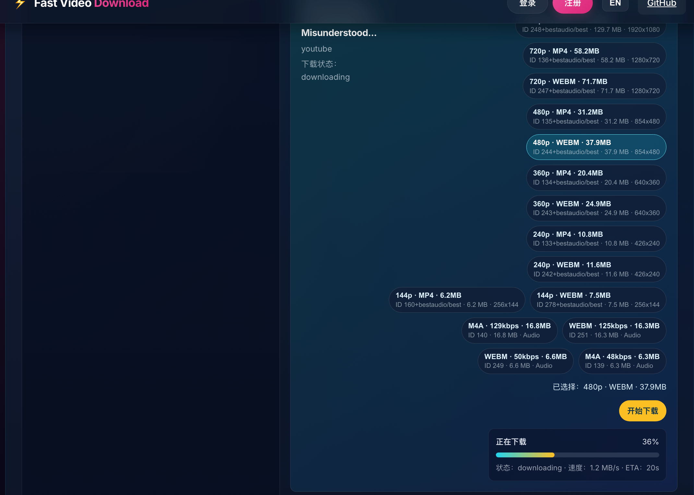
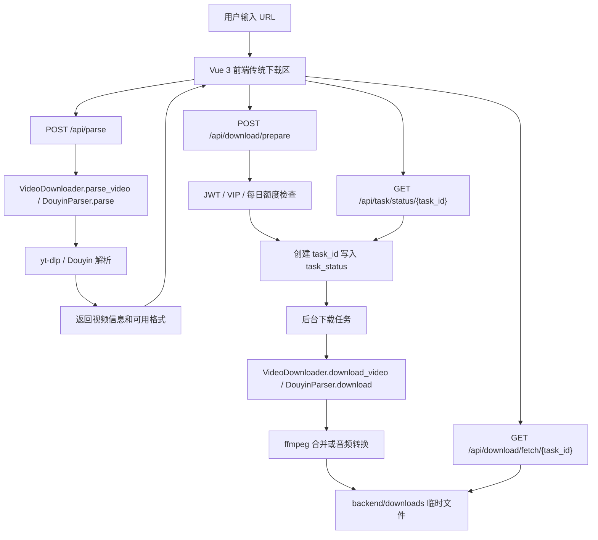
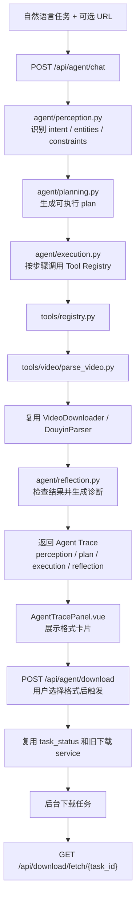

# Fast Video Download ⚡️

[](https://github.com/ZKQuinn/fast-video-download)
[](LICENSE)

Fast Video Download 是一个基于 **FastAPI + Vue 3 + yt-dlp + ffmpeg** 的视频任务系统。项目保留了原有“传统视频下载站”能力，同时新增了 **AI Agent 模式**：用户可以用自然语言描述视频任务，系统会展示意图识别、执行计划、工具调用、反思诊断、格式选择和下载进度。

> 合规说明：本项目仅用于技术学习和研究。请只下载自己拥有版权或已获得合法授权的内容，并遵守平台条款与当地法律法规。

## 快速开始

环境要求：

- Python 3.10+
- Node.js 18+
- npm
- ffmpeg（推荐已安装到系统 PATH；未安装时会尝试走 `static-ffmpeg`）

首次启动：

```bash
cp .env.example .env
chmod +x dev.sh
./dev.sh
```

启动后访问：

- 前端：http://127.0.0.1:5173
- 后端：http://127.0.0.1:8000
- 健康检查：http://127.0.0.1:8000/api/health

默认建议先用 Demo Mode 验证界面和 Agent 链路；准备真实下载时，再把 `.env` 中的 `AGENT_DEMO_MODE` 改为 `false`。

---

## 视觉展示

### 传统模式视觉展示

传统模式保留原来的直接解析下载体验：输入 URL，解析视频信息，选择格式，创建下载任务并获取文件。

<div align="center">
  
  <p><i>图 1：传统视频下载首页</i></p>

  <br />

  
  <p><i>图 2：传统模式解析结果与格式选择</i></p>

  <br />

  
  <p><i>图 3：传统模式下载进度</i></p>

  <br />

  
  <p><i>图 4：VIP 会员与支付入口</i></p>

  <br />

  
  <p><i>图 5：支付界面</i></p>
</div>

### AI Agent 模式视觉展示

Agent 模式把原来的下载能力包装成“视频任务工作台”：先理解用户指令，再生成计划，调用工具解析视频，展示可选格式，用户确认后复用旧下载任务系统完成下载。

<div align="center">
  
  <p><i>图 6：AI Agent 视频任务工作台，支持 Real Mode / Demo Mode 和健康检查</i></p>

  <br />

  
  <p><i>图 7：Agent 展示运行模式、意图识别、执行计划、工具调用和反思结果</i></p>

  <br />

  
  <p><i>图 8：下载任务先解析视频并等待用户选择格式，不再默认直接下载</i></p>

  <br />

  
  <p><i>图 9：用户选择格式后创建下载任务，展示进度条、速度、ETA，完成后显示下载文件按钮</i></p>
</div>

---

## 当前能力

- **传统下载模式**：输入 URL 后直接解析视频，展示格式列表，用户选择格式后创建后端下载任务。
- **AI Agent 模式**：支持自然语言输入，展示 Perception / Planning / Execution / Reflection 全链路。
- **格式选择**：Agent 解析后展示 `resolution`、`ext`、`format_id`、`filesize`，用户确认后才开始下载。
- **下载进度**：Agent 模式复用旧任务机制，轮询任务状态，展示 `status`、`progress`、`speed`、`eta`。
- **真实模式诊断**：关闭 Demo Mode 后，真实执行失败会显示 `failed_step`、`exception_type`、`exception_message` 和 yt-dlp 错误摘要。
- **健康检查**：后端提供 `/api/health`，展示后端状态、Demo Mode、Python 版本、下载目录、yt-dlp 和 ffmpeg 可用性。
- **认证与商业化**：保留 JWT 登录注册、VIP 限额和 Stripe 支付逻辑。
- **平台支持**：通用平台走 yt-dlp，抖音有独立解析/下载封装。

---

## 项目架构

### 传统模式架构

传统模式是经典 Web 下载站流程：前端解析 URL，后端用 yt-dlp 解析元数据，用户选择格式后创建下载任务，前端轮询任务进度，最终从 fetch 接口下载文件。



### AI Agent 模式架构

Agent 模式不是复制一套下载器，而是作为旧下载能力的智能入口。Agent 负责理解任务、生成计划、调用 tools、展示诊断；真正下载仍复用旧任务系统。



### 后端目录结构

```text
backend/
├── main.py                         # FastAPI 入口，传统 API + Agent API
├── downloader.py                   # 原有 yt-dlp 下载/解析逻辑
├── douyin.py                       # 抖音解析/下载逻辑
├── auth.py                         # JWT 认证
├── models.py                       # 用户/VIP 数据模型
├── database.py                     # SQLAlchemy 数据库连接
└── app/
    ├── agent/
    │   ├── perception.py           # 自然语言到结构化任务上下文
    │   ├── planning.py             # 规则 Planner + LLMPlanner 扩展点
    │   ├── execution.py            # 串行执行 plan steps
    │   ├── reflection.py           # 结果检查与失败诊断
    │   └── orchestrator.py         # Agent 主流程编排
    ├── tools/
    │   ├── base.py                 # Tool dataclass
    │   ├── registry.py             # Tool Registry
    │   └── video/
    │       ├── parse_video.py      # parse_video tool，封装旧解析逻辑
    │       ├── download_video.py   # download_video tool，封装旧下载逻辑
    │       └── parse_douyin.py     # parse_douyin tool
    ├── llm/
    │   └── client.py               # LLM 调用入口，当前可替换真实模型
    └── download_tasks.py           # 共享下载任务状态
```

### 前端目录结构

```text
frontend/src/
├── App.vue                         # 首页组合：Agent 模式 + 传统模式
├── api.js                          # REST API 封装
├── components/
│   ├── AgentChat.vue               # Agent 工作台输入区和健康检查
│   ├── AgentTracePanel.vue         # Agent Trace、格式选择、进度、下载按钮
│   ├── VideoResult.vue             # 传统模式解析结果和下载流程
│   ├── NavBar.vue
│   ├── AuthModal.vue
│   └── PricingModal.vue
└── i18n.js
```

---

## 请求链路

### 传统模式链路

1. 用户在传统模式输入 URL。
2. 前端调用 `POST /api/parse`。
3. 后端根据 URL 分流到 `DouyinParser` 或 `VideoDownloader.parse_video()`。
4. 前端展示视频信息和格式列表。
5. 用户选择格式，前端调用 `POST /api/download/prepare`。
6. 后端完成认证、VIP 限额检查，创建 `task_id`。
7. 后端后台下载，更新 `task_status`。
8. 前端轮询 `GET /api/task/status/{task_id}`。
9. 完成后前端跳转 `GET /api/download/fetch/{task_id}` 下载文件。

### Agent 模式链路

1. 用户在 Agent 工作台输入自然语言，例如“帮我下载这个视频”。
2. 前端调用 `POST /api/agent/chat`。
3. 后端执行 `perception -> planning -> execution -> reflection`。
4. 当前下载类任务默认只执行 `parse_video`，返回 `available_formats`。
5. 前端展示 Agent Trace 和格式卡片。
6. 用户点击格式卡片并点击“开始下载”。
7. 前端调用 `POST /api/agent/download`。
8. 后端复用旧下载任务机制创建 `task_id`。
9. 前端轮询 `GET /api/task/status/{task_id}` 或 `GET /api/download/status/{task_id}`。
10. 完成后显示“下载文件”按钮，指向 `/api/download/fetch/{task_id}`。

---

## API 概览

### 健康检查

```bash
curl http://127.0.0.1:8000/api/health
```

返回后端状态、Demo Mode、Python 版本、下载目录、ffmpeg 和 yt-dlp 可用状态。

### 传统视频解析

```bash
curl -X POST http://127.0.0.1:8000/api/parse \
  -H "Content-Type: application/json" \
  -d '{"url": "https://www.youtube.com/watch?v=example"}'
```

### 传统下载任务

```bash
curl -X POST http://127.0.0.1:8000/api/download/prepare \
  -H "Content-Type: application/json" \
  -d '{"url": "https://www.youtube.com/watch?v=example", "format_id": "best", "is_audio_only": false}'
```

### Agent Chat

```bash
curl -X POST http://127.0.0.1:8000/api/agent/chat \
  -H "Content-Type: application/json" \
  -d '{
    "message": "帮我下载这个视频",
    "session_id": "demo-session",
    "context": {
      "url": "https://www.youtube.com/watch?v=example"
    }
  }'
```

### Agent Dry Run

只生成 perception 和 plan，不真实调用下载工具：

```bash
curl -X POST http://127.0.0.1:8000/api/agent/chat \
  -H "Content-Type: application/json" \
  -d '{
    "message": "帮我下载这个视频",
    "dry_run": true,
    "context": {
      "url": "https://www.youtube.com/watch?v=example"
    }
  }'
```

### Agent 下载任务

用户选择格式后创建下载任务：

```bash
curl -X POST http://127.0.0.1:8000/api/agent/download \
  -H "Content-Type: application/json" \
  -d '{
    "url": "https://www.youtube.com/watch?v=example",
    "format_id": "best",
    "is_audio_only": false,
    "session_id": "demo-session"
  }'
```

---

## 本地启动

### 一键启动

首次 clone 后，在项目根目录执行：

```bash
cp .env.example .env
chmod +x dev.sh
./dev.sh
```

启动后访问：

- 前端页面：http://127.0.0.1:5173
- 后端 API：http://127.0.0.1:8000
- 健康检查：http://127.0.0.1:8000/api/health

### 手动启动后端

```bash
cd backend
python3 -m venv venv
./venv/bin/python -m pip install -r requirements.txt
./venv/bin/python -m uvicorn main:app --reload --host 127.0.0.1 --port 8000
```

### 手动启动前端

```bash
cd frontend
npm install
npm run dev -- --host 127.0.0.1 --port 5173
```

补充说明：

- `dev.sh` 会自动创建 `backend/venv`、安装后端依赖，并在 `frontend/node_modules` 不存在时执行 `npm install`。
- 下载文件默认保存在 [backend/downloads](/Users/kwin/kwinLearn/fast-video-download/backend/downloads)。
- SQLite 数据库默认是项目根目录下的 `fast_download.db`。

---

## 环境变量

复制 `.env.example` 到 `.env` 后按需修改：

```env
FRONTEND_BASE_URL=http://localhost:5173
FRONTEND_ORIGINS=http://localhost:5173,http://127.0.0.1:5173
SECRET_KEY=change-me-for-local-development
AGENT_DEMO_MODE=true
LLM_API_KEY=
LLM_BASE_URL=https://api.openai.com/v1
LLM_MODEL=gpt-4o-mini
STRIPE_API_KEY=
STRIPE_WEBHOOK_SECRET=
BILIBILI_COOKIE_FILE=
```

- `AGENT_DEMO_MODE=true`：Agent Chat 返回稳定模拟数据，适合展示。
- `AGENT_DEMO_MODE=false`：真实调用 `parse_video` tool，并在用户选择格式后创建真实下载任务。
- `LLM_API_KEY` / `LLM_BASE_URL` / `LLM_MODEL`：只在启用 LLM Planner 时使用；留空时会走规则兜底。
- `BILIBILI_COOKIE_FILE`：部分 B 站视频需要 Cookie 才能解析或下载。
- `STRIPE_API_KEY` / `STRIPE_WEBHOOK_SECRET`：只在测试支付功能时需要。

---

## Demo Mode 与 Real Mode

### Demo Mode

适合演示界面，不下载真实文件：

```env
AGENT_DEMO_MODE=true
```

特点：

- `/api/agent/chat` 返回稳定的 perception / plan / execution / reflection。
- 不依赖真实视频链接是否可访问。
- 不创建真实下载任务。

### Real Mode

适合真实验证：

```env
AGENT_DEMO_MODE=false
```

真实模式建议步骤：

1. 确认 `/api/health` 中 `yt_dlp.available=true`。
2. 确认 `/api/health` 中 `ffmpeg.available=true`。
3. 在 Agent 工作台输入“帮我解析这个视频”或“帮我下载这个视频”。
4. 等待 Agent 返回格式列表。
5. 选择一个格式并点击“开始下载”。
6. 观察进度条、速度、ETA。
7. 任务完成后点击“下载文件”。

---

## 测试与验证

后端单元测试：

```bash
backend/venv/bin/python -m unittest \
  backend/test_app_agent_api.py \
  backend/test_app_orchestrator.py \
  backend/test_app_execution.py \
  backend/test_app_reflection.py \
  backend/test_app_planning.py \
  backend/test_app_perception.py \
  backend/test_app_tools.py \
  backend/test_downloader_config.py
```

Python 编译检查：

```bash
backend/venv/bin/python -m compileall backend/main.py backend/app backend/downloader.py
```

前端构建：

```bash
cd frontend
npm run build
```

---

## 常见问题

- `yt-dlp 未安装`：进入 `backend` 后运行 `./venv/bin/python -m pip install -r requirements.txt`，或重新执行 `./dev.sh`。
- `ffmpeg 未安装`：安装系统 `ffmpeg`，或确认 `static-ffmpeg` 能正常下载/加载；`/api/health` 会显示可用状态。
- `B 站 412`：BiliBili 反爬返回 `HTTP Error 412: Precondition Failed`，通常需要更新 `yt-dlp`、配置有效 Cookie，或稍后重试。
- `Cookie 缺失`：部分平台需要登录态。将 Cookie 文件路径配置到 `.env`，并确认文件未过期、后端进程可读取。
- `CORS`：确认 `.env` 中 `FRONTEND_ORIGINS` 包含当前前端地址，例如 `http://127.0.0.1:5173`。
- `后端端口错误`：前端默认请求 `http://127.0.0.1:8000/api`，如果后端端口变更，需要同步修改前端 API 基础地址。
- `Agent 没有直接下载`：这是当前产品语义。Agent 会先解析并展示格式，用户确认格式后才创建下载任务。
- `下载按钮不出现`：只有任务状态为 `completed` 且后端返回 `download_url` 后才显示按钮。

---

## 技术栈

- 后端：FastAPI、SQLAlchemy、SQLite、yt-dlp、static-ffmpeg、Stripe、python-jose、passlib
- 前端：Vue 3、Vite、原生 Fetch API、CSS Glassmorphism UI
- Agent：Perception、Planning、Execution、Reflection、Tool Registry、LLM Client 扩展点

---

## 免责声明

本项目仅用于技术学习和研究目的。用户在使用本程序下载任何音视频内容时，必须确保已获得原作者授权并遵守相关法律法规、平台服务条款和版权要求。任何滥用导致的后果由用户个人承担。

---

© 2026 Fast Video Download. Developed by ZKQuinn.
